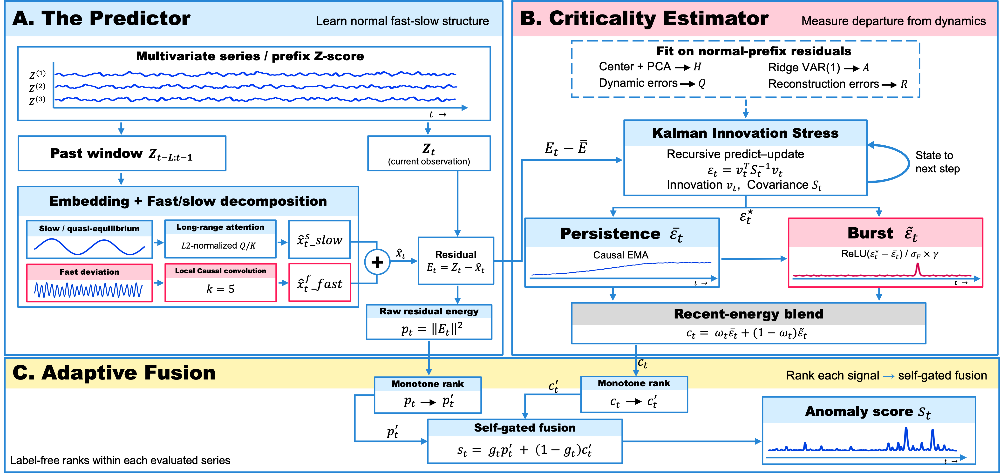
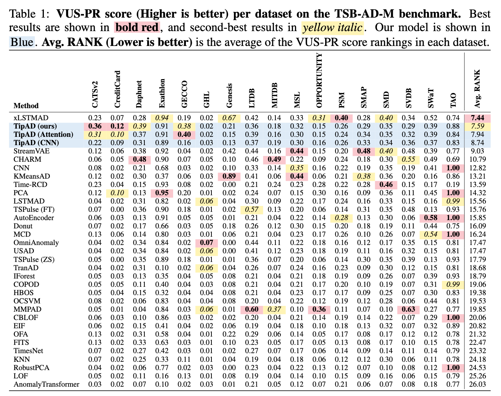

# TipAD

Code and data for reproducing the main results of **TipAD**.

## Repository Layout

```
src/tipad/
├── predictor.py              
├── criticality_estimator.py  
├── fusion.py                 
├── model.py                  
├── config.py                 
└── data.py                   

experiments/
├── run_tipad.py          train + evaluate on TSB-AD-M
└── compare_baselines.py  rank against official baselines

data/
├── File_List/                        
│   ├── TSB-AD-M-Tuning.csv           tuning — hyperparameter selection only
│   └── TSB-AD-M-Eva.csv              eval
└── benchmark_results/                
    ├── multi_mergedTable_VUS-PR.csv  official VUS-PR, 30 classical baselines
    └── leaderboard/
        └── Multi_*.csv               official VUS-PR, recent SOTA baselines

figures/    architecture + results figures
```

## Architecture



We reformulate an anomaly as a crossing, the system’s departure from its stable state. Inspired by this, we propose **TipAD**, a multivariate anomaly detection method. 

## Overall Comparison



## Data

TipAD is evaluated on **TSB-AD-M**, the multivariate track of TSB-AD. The raw dataset file is too large for GitHub and must be downloaded separately.

Download [TSB-AD-M.zip](https://www.thedatum.org/datasets/TSB-AD-M.zip) and unzip it into `data/`, giving `data/TSB-AD-M/`.

> If this link doesn't work, search for the TSB-AD benchmark (NeurIPS 2024) for the current download location.

## Setup

```bash
pip install -r requirements.txt
```

## Reproducing the Main Results

We ran the experiments reported in the paper on an Apple M3 (8-core CPU), 24GB RAM, CPU only, no GPU (see Appendix B).

### Quick start

```bash
nohup bash run_all.sh > run.log 2>&1 &
tail -f run.log
```

That's the whole procedure. A preflight report prints immediately (detected memory, CPU count, whether the requested workers fit), followed by per-series training progress. Once you see that, the environment is set up correctly, and you can leave the run unattended.

The run finishes by printing the Avg.RANK comparison table. Results are written to `experiments/eval_merged.csv` (this is the file the paper reports), alongside the per-seed `experiments/eval_merged_s2023.csv` and `experiments/eval_merged_s2024.csv`.

**Workers do not change the results**, only how long the run takes.

**Interrupted runs resume safely.** Stopping the run at any point never corrupts it. Re-running the same command picks up where it left off; series already computed (cached in `eval_arrays_s<seed>/`) are skipped.


### Choosing the number of workers

`run_all.sh` takes the number of parallel workers as its only argument (default 4). Pick the largest row your machine can satisfy:

| Workers | RAM needed | Runtime | Suitable for |
|--------:|-----------:|--------:|--------------|
| 1       | ~3 GB      | far longer than 6 hours   | any machine, also used to verify determinism |
| 2       | ~5 GB      | well over 6 hours   | 8 GB laptops |
| 4       | ~10 GB     | >6 h    | default, 16 GB and up |
| 8       | ~20 GB     | ~6h     | 24 GB and up |

Measured on the reference platform: Apple M3 (8 cores, 4 performance + 4 efficiency), 24 GB RAM, MacBook Air (Mac15,12), CPU only, no GPU used.


### Running each phase manually

If you'd rather control each phase yourself, or parallelize by hand instead of letting run_all.sh manage workers, see below for what each step does and how to run them manually.

#### 1. Train

```bash
cd experiments
python3 run_tipad.py --phase train
```

#### 2. Evaluate 

**Option A — single process** Results are merged automatically when the run finishes, so no separate merge step is needed:

```bash
python3 run_tipad.py --phase eval --seed 2023
python3 run_tipad.py --phase eval --seed 2024
```

**Option B — sharded** (faster). Split a seed into N shards, run them
concurrently, then merge

```bash
# seed 2023
seq 0 3 | xargs -P 4 -I{} \
  python3 run_tipad.py --phase eval --seed 2023 --shard {} --nshards 4
python3 run_tipad.py --phase merge --seed 2023

# seed 2024
seq 0 3 | xargs -P 4 -I{} \
  python3 run_tipad.py --phase eval --seed 2024 --shard {} --nshards 4
python3 run_tipad.py --phase merge --seed 2024
```

#### 3. Average the two seeds

Writes `eval_merged.csv`, the file the paper reports.

```bash
python3 average_seeds.py 2023 2024
```

#### 4. Compare against the baselines

Reads `eval_merged.csv` and prints the Avg.RANK table.

```bash
python3 compare_baselines.py
```


