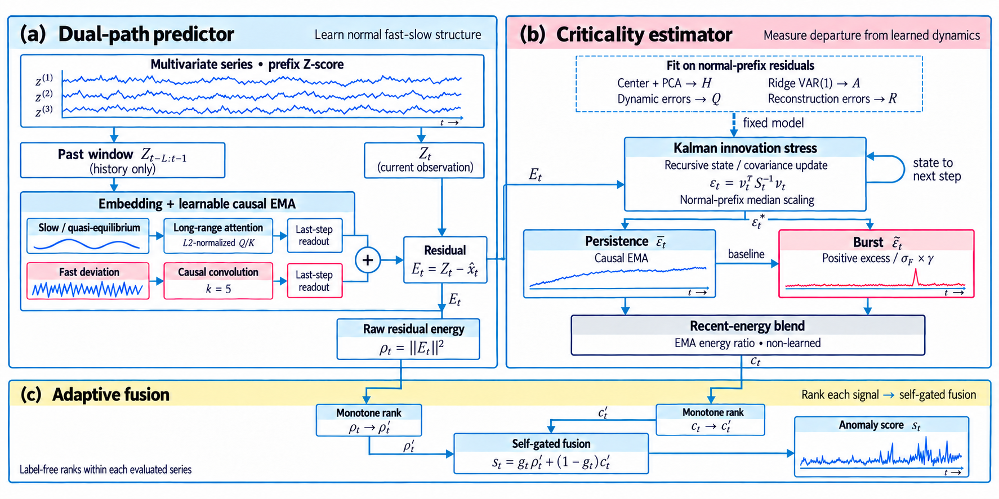

# TipAD

Code for the paper *TipAD*, a multivariate time-series anomaly detection method.

## Repository Layout

```
src/tipad/
  predictor.py             dual-path predictor (attention slow head, conv fast head)
  criticality_estimator.py state-space identification -> Kalman filter -> NIS ->
                           persistence/burst decomposition -> criticality score
  fusion.py                rank normalization + self-gated softmax
  model.py                 wires the three modules above into TipAD end to end
  config.py                TipADConfig (frozen hyperparameters)
  data.py                  TSB-AD-M loading / preprocessing

experiments/
  run_tipad.py         train (select fusion on Tuning) + evaluate on Eval
  compare_baselines.py rank against the official TSB-AD baselines/leaderboard

data/       TSB-AD-M file lists + official baseline scores (see data/README.md)
figures/    architecture diagram
```

## Architecture



Dual-path predictor -> Kalman-filter-based criticality estimator -> adaptive fusion.

## Results

<!-- TODO: results figure/table (e.g. Avg.RANK on TSB-AD-M) -->

## Setup

```bash
pip install -r requirements.txt
```

Download the TSB-AD-M series pool into `data/` — see `data/README.md`.

## Reproducing the Main Results

```bash
cd experiments
python3 run_tipad.py --phase train
python3 run_tipad.py --phase eval --shard 0 --nshards 1
python3 compare_baselines.py
```

| step | what it does |
|---|---|
| `train` | selects the fusion mode and softmax sharpness kappa on TSB-AD-M-Tuning |
| `eval` | freezes those and scores every series in TSB-AD-M-Eva |
| `compare_baselines` | reproduces the paper's Avg.RANK table against the official baselines |

`--nshards` splits `eval` across parallel processes (each with its own
`--shard`); run `--phase merge` afterward to combine them.

